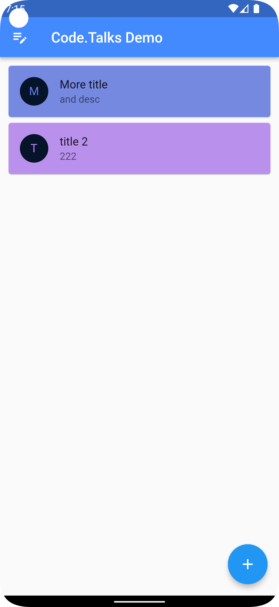

# code_talks_demo

A new Flutter projectfor Code.Talks 2022.

## Getting Started

This project is a starting point for a Flutter application.

A few resources to get you started if this is your first Flutter project:

- [Lab: Write your first Flutter app](https://docs.flutter.dev/get-started/codelab)
- [Cookbook: Useful Flutter samples](https://docs.flutter.dev/cookbook)

For help getting started with Flutter development, view the
[online documentation](https://docs.flutter.dev/), which offers tutorials,
samples, guidance on mobile development, and a full API reference.

## Build & deploy the Project

TL;DR: https://docs.flutter.dev/deployment/obfuscate

### Android

Open our emulator and:

    flutter run

### iOS

Make your Mac and xCode ready for usual iOS/MacOS development, then you can run:

    flutter build ios

### Web
Build & run via:

    flutter run -d chrome

Deploy clean state:

    rm -rf build/web/
    flutter build web --release --dart-define=FLUTTER_WEB_USE_SKIA=true 

### Update Icon
Replace the icon within the `assets` folder and run:

    flutter pub run icons_launcher:create

## Demo

